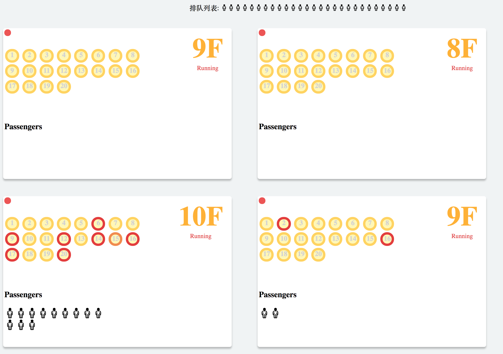
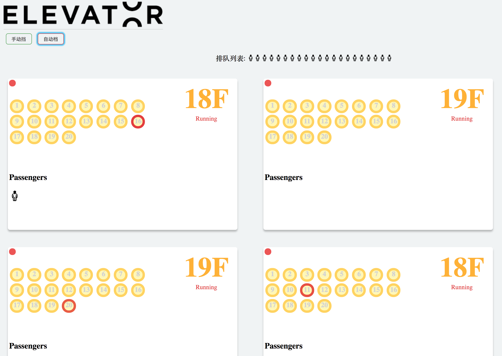

# Elevator-Dispatcher

Just a dispatcher for simulating the working status of elevators in reality.

[中文说明](./README_CN.md)

## Screenshots





## Get started

```
$ npm install
$ npm run start
```

## Production

```
$ npm run build
```

